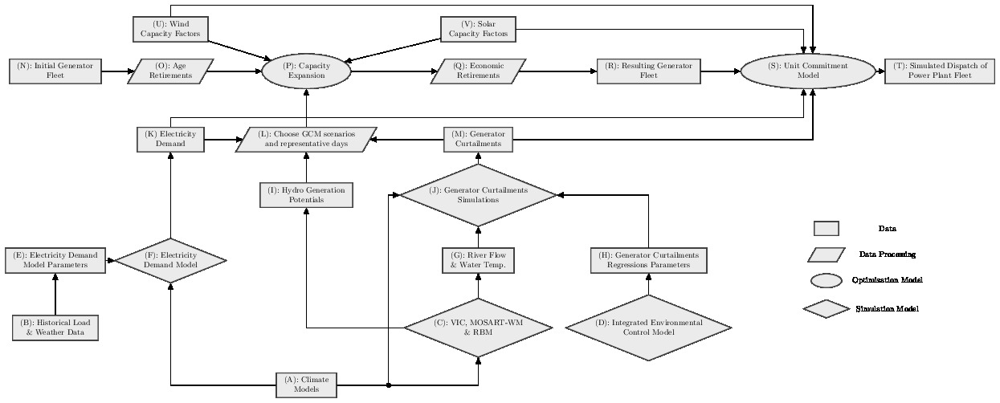

.. test_documentation documentation master file, created by
   sphinx-quickstart on Thu Apr 16 11:34:36 2020.
   You can adapt this file completely to your liking, but it should at least
   contain the root `toctree` directive.

Capacity expansion / unit commitment and economic dispatch under climate change
*************************************************************************************

.. toctree::
   :hidden:
   :maxdepth: 2

   intro
   Input data/index
   Parameters/index
   Main Scripts/index
   Thermal deratings/index

Introduction
=============

To run a CE, UCED, or combined CE/UCED simulation the function ``masterFunction()`` (see :ref:`main-scripts`) must be called within a python script. This python script must also load the parameters needed to execute the simulation and pass them as arguments to ``masterFunction()``.

A minimal example of how to execute a capacity expansion only analysis from 2015 to 2050 is illustrated below. The txt files are formatted csv files that contain the parameters data. 

The parameters are python objects in which the fields store the values of specific parameters. After loading the values of the different parameters, they can also be changed by setting the values of the fields directly.
::

   # Load parameters
   genparam = Generalparameters.Generalparameters()
   genparam.load(fname='generalparameters.txt')

   reserveparam = Reserveparameters.Reserveparameters()
   reserveparam.load(fname='reserveparameters.txt')

   curtailparam = Curtailmentparameters.Curtailmentparameters()
   curtailparam.load(fname='curtailmentparameters.txt')

   # run only capacity expansion (CE) simulation
   genparam.runCE = True
   genparam.runFirstUCYear = False
   genparam.runUC = False

   # define start and end years of CE simulation
   genparam.startYear = 2015
   genparam.endYear = 2040

   masterFunction(genparam, reserveparam, curtailparam)

Indices and tables
==================

* :ref:`genindex`
* :ref:`modindex`
* :ref:`search`
